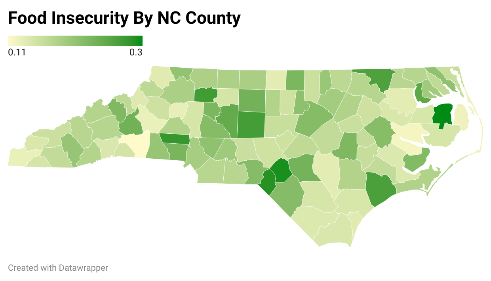
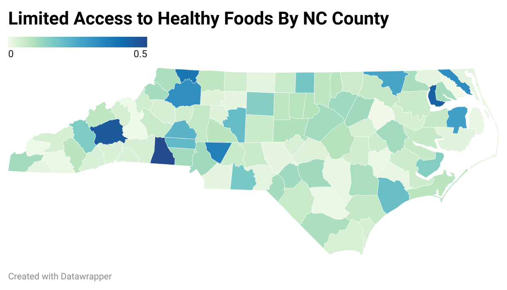

Obesity Rates vs. Food Availability On a National Level

**What is included in this repository***
-The Python3 notebook documenting the manipulation of the raw data into a subset of new data. 
-The original raw data: CountyHealthData_2014-2015.csv
-The modified data subset: Subset.csv
-Three heatmap visualizations depicting the prevalence of Adult Obesity, Limited Access to Healthy Foods, and Food Insecurity across the state of North Carolina
-README file 

**Purpose**: to qualitatively and quantitatively illustrate the relationship between Adult Obesity, Limited Access to Healthy Foods, and Food Insecurity across the state of North Carolina. 

*Data Visualization*: As an example of the potential uses of this data manipulation method, the rates of adult obesity, limited access to healthy foods, and food insecurity in the state of North Carolina were isolated from the raw data set. This subset (quantitative) was then input into Datawrapper and used to create three heatmap visualizations (qualitative). 

     
     
     

**Potential**: Only the state of North Carolina was examined in the example above, however, the data subset created (full instructions are in the file called Python_Notebook_AnnaMaria.ipynb) could be used to analyze any of the states and counties included in the original raw data file. 

Potential uses for the data include: 
  1. At-a-glance trend visualization for public health professionals regarding the state of obesity rates.
  2. Correlational/observational public health studies.
  3. Indication of which geographical areas are in most need of public health initiatives.

**Provenance**: the CountyHealthData_2014-2015.csv provided by Professor Gotzler was used as raw data.

